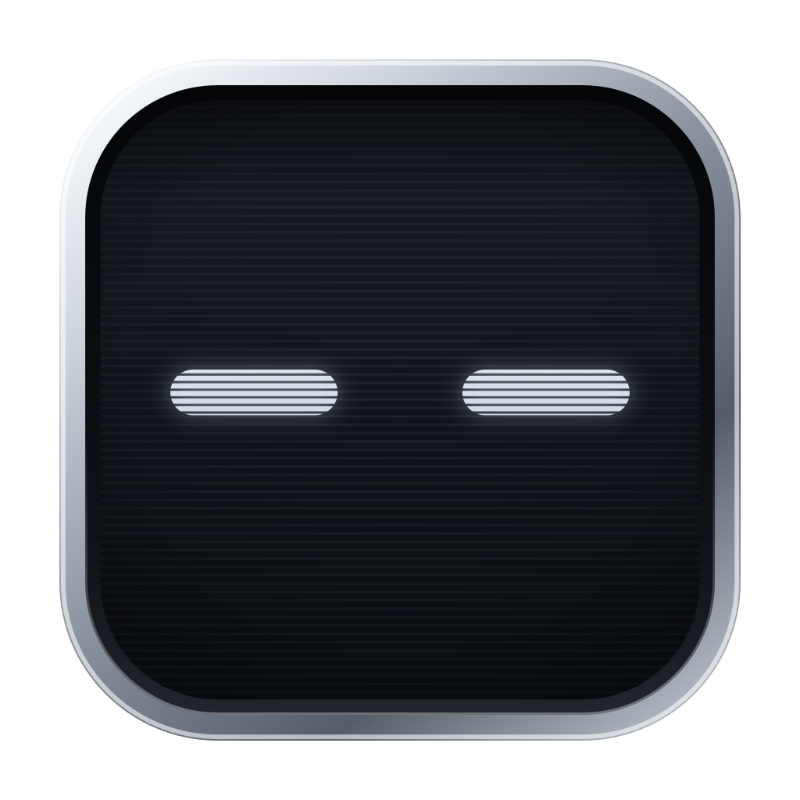
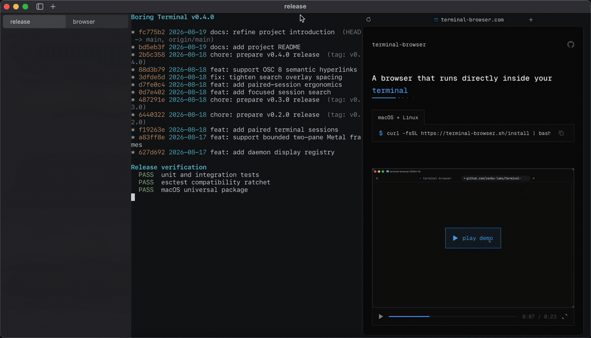

<p align="center">
  
</p>

<h1 align="center">Boring Terminal</h1>

<p align="center">A calm, fast macOS terminal built around long-running sessions.</p>

<p align="center">
  <a href="https://boringterminal.com">Website</a> ·
  <a href="https://boringterminal.com/docs/introduction/">Docs</a> ·
  <a href="https://github.com/boringterminal/boringterminal/releases/latest">Download</a> ·
  <a href="#development">Development</a>
</p>

<p align="center">
  
</p>

## About

Boring Terminal keeps shells, builds, and coding agents together as
long-running sessions, and makes it easy to see which one needs you. Built in
the agent era, not only for it: whether you run ten agents or one shell, the
terminal's job is the same. Stay out of the way, and tell you when something
wants you.

GPU-rendered with Metal, Mac-native everywhere it matters, MIT licensed.

## Features

### Persistent sessions

Closing the window does not end a long-running agent, shell, or build. A
background service owns every session; open Boring Terminal again and it is
where you left it.

### Session sidebar and attention

Open sessions stay in a vertical sidebar. Sessions that need you get a quiet
orange dot there, and the Dock badge counts them. Attention is driven by
standard escape sequences (BEL, OSC 9, OSC 777, OSC 133 exit codes), so it
works with any agent and any tool. No notifications, no per-agent
integrations.

### Split sessions

Two related sessions can sit side by side. One pair, nothing to configure.
The pair, its divider, and its zoom survive closing the window.

### Search

<kbd>⌘F</kbd> searches the focused session's scrollback, with
<kbd>⌘G</kbd> / <kbd>⇧⌘G</kbd> match navigation.

### Terminal graphics

Images and video render inline alongside text. Boring Terminal implements the
Kitty graphics and keyboard protocols.

### Mac-native input

Real IME input, dead keys, emoji, secure input, and drag-and-drop file paths
from Finder.

### Keyboard shortcuts

The full reference is in the app under **Help › Keyboard Shortcuts**
(<kbd>⌘?</kbd>).

## Install

The [latest release](https://github.com/boringterminal/boringterminal/releases/latest)
is a universal build (Apple silicon and Intel) for macOS 13 and later. Drag
the app into `/Applications`.

Releases are ad-hoc signed and not yet notarized, so Gatekeeper refuses a
plain double-click the first time. Any one of these paths works, once:

- **macOS 13 and 14:** Control-click the app in Finder, choose **Open**, then
  confirm.
- **macOS 15 and later:** double-click once and dismiss the warning, then open
  **System Settings › Privacy & Security** and click **Open Anyway**.
- **From a terminal:**

  ```sh
  xattr -dr com.apple.quarantine "/Applications/Boring Terminal.app"
  ```

## Documentation

User documentation (sessions, attention routing for agent authors, keyboard
shortcuts, configuration, compatibility) is at
[boringterminal.com](https://boringterminal.com); its source lives in
[`website/`](website/). Design decisions are recorded as RFCs in
[`docs/rfcs`](docs/rfcs).

## Awesome apps we support

- [terminal-browser](https://terminal-browser.com)

## Development

Requires Zig 0.16.0 and the macOS SDK.

```sh
zig build run      # build and launch the app
zig build test     # unit/property/integration tests
zig build esctest  # VT conformance ratchet
```

The VT core is checked against the independent
[esctest2](docs/references/conformance-testing.md) terminal conformance suite
and a source-independent Kitty keyboard conformance ratchet on every change.
